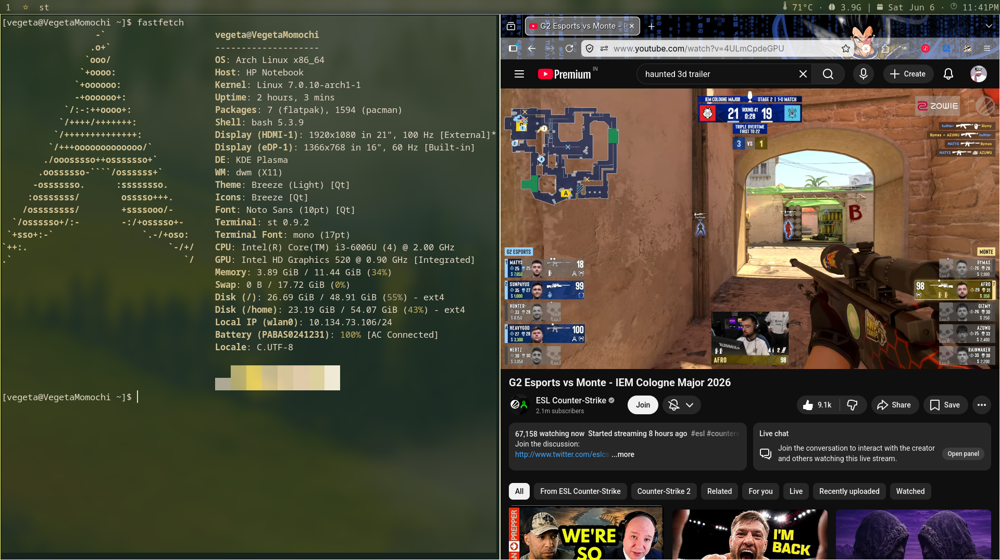
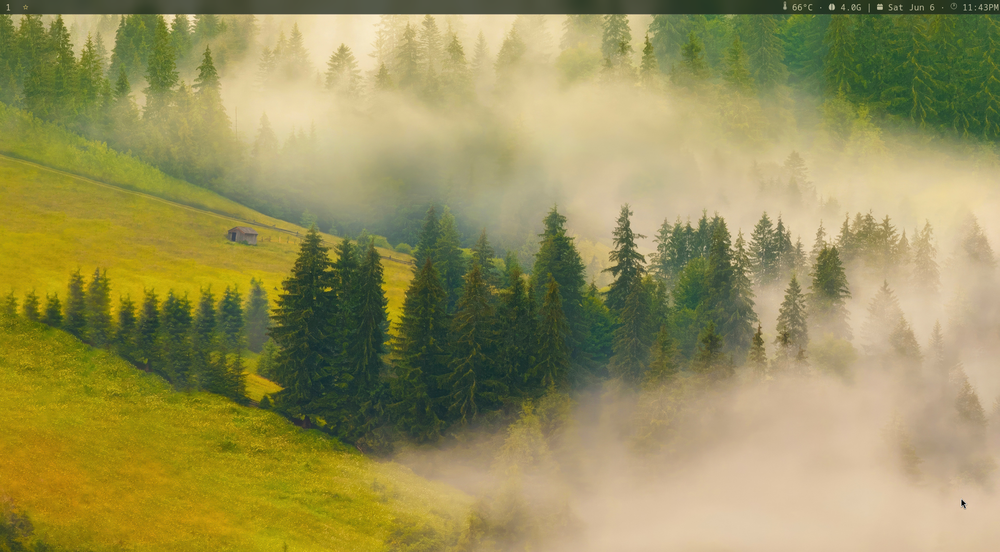

<p>
  
  
</p>

# DOTFILES

My personal Arch Linux + dwm desktop configuration. Minimal, keyboard-driven, and color-adaptive via pywal.

---

## System Overview

| Component | Tool |
|-----------|------|
| OS | Arch Linux |
| WM | dwm (suckless) |
| Terminal | st (suckless) |
| Launcher | dmenu |
| Shell | bash / zsh |
| File Manager | fff + ranger |
| Image Preview | ueberzug++ |
| Color Theming | pywal |
| Compositor | picom |
| Notifications | dunst |
| Status Bar | dwm built-in |

---

## Features

- **pywal** — generates a colorscheme from your wallpaper and propagates it to dwm, dmenu, st, dunst, and the terminal automatically on startup via `~/.bashrc`
- **ueberzug++** — image previews in the terminal (configured for X11 backend; switch to `wayland` in `bashrc` if needed)
- **fff** — fast, minimal terminal file manager with a custom opener script (`~/.local/bin/fff-opener`) for filetype handling
- **fzf + ueberzug++ wallpaper picker** — fuzzy wallpaper selection with live image preview via the `wallpaper` alias
- **suckless stack** — dwm, dmenu, and st are compiled from source with custom patches; edit `config.h` and run `install.sh` to rebuild

---

## Repository Structure

```
dotfiles/
├── config/          # App configs (ranger, dunst, picom, etc.)
├── misc/            # Miscellaneous extras
├── scripts/
│   └── images-photos-wallpapers/   # fzf+ueberzug++ wallpaper picker (fzfub)
├── suckless/
│   ├── dwm/         # Window manager source + config.h
│   ├── dmenu/       # Launcher source + config.h
│   ├── st/          # Terminal source + config.h
│   └── dwmblocks/   # Status bar source
├── .xinitrc         # X session startup
├── bashrc           # Shell config (pywal, ueberzug++, fff, PATH)
├── install.sh       # Bootstrap: build suckless tools, init pywal cache
├── pkglist-official.txt   # Official repo packages
└── pkglist-aur.txt        # AUR packages
```

---

## Installation

### 0. Prerequisites — install paru (AUR helper)

```bash
sudo pacman -S --needed base-devel git
git clone https://aur.archlinux.org/paru.git
cd paru && makepkg -si && cd ..
```

> **Note:** If paru compilation freezes (common in VMs with low RAM), use `yay-bin` instead:
> ```bash
> git clone https://aur.archlinux.org/yay-bin.git
> cd yay-bin && makepkg -si && cd ..
> ```

### 1. Clone the repo

```bash
git clone https://github.com/Vegetamomochi/dotfiles ~/dotfiles
cd ~/dotfiles
```

### 2. Install packages

```bash
# Official packages
sudo pacman -S --needed - < pkglist-official.txt

# AUR packages
paru -S --needed - < pkglist-aur.txt
```

### 3. Run the install script

Initializes the pywal cache and compiles dwm, dmenu, st, and dwmblocks:

```bash
chmod +x install.sh
./install.sh
```

### 4. Link configs

```bash
cp ~/dotfiles/bashrc ~/.bashrc

# Symlink app configs
ln -s ~/dotfiles/config/dunst ~/.config/dunst
ln -s ~/dotfiles/config/picom ~/.config/picom
ln -s ~/dotfiles/config/ranger ~/.config/ranger
```

### 5. Copy xinitrc

```bash
cp ~/dotfiles/.xinitrc ~/.xinitrc
```

> **Note:** Edit `~/.xinitrc` to match your display output. Run `xrandr` to find your output name (e.g. `HDMI-1`, `eDP-1`, `Virtual-1`) and update the xrandr line accordingly.

### 6. Add a wallpaper

```bash
mkdir -p ~/Wallpaper
# Copy your wallpaper to ~/Wallpaper/
```

### 7. Start the session

```bash
startx
```

---

## Theming with pywal

```bash
# Set a new wallpaper and regenerate colors
wal -i ~/Wallpaper/your-image.jpg

# Or use the fuzzy wallpaper picker
wallpaper
```

Colors are sourced into the shell on every terminal start via `~/.bashrc`:

```bash
source ~/.cache/wal/colors.sh
```

---

## fff Configuration

fff uses a custom opener defined in `bashrc`:

```bash
export FFF_OPENER="$HOME/.local/bin/fff-opener"
```

Edit `~/.local/bin/fff-opener` to control how different file types are opened (images → feh, video → mpv, PDFs → zathura, etc.).

### ueberzug++ image previews in fff

```bash
export UEBERZUG_BACKEND=x11
```

Change to `wayland` if running a Wayland compositor.

---

## Suckless Tools

```bash
cd ~/dotfiles/suckless/dwm
# Edit config.h
sudo make clean install
# Same for dmenu, st, and dwmblocks
```

The pywal dwm patch reads colors from `~/.cache/wal/colors-wal.dwm` — regenerated automatically when you run `wal`.

---

## AUR Packages

| Package | Purpose |
|---------|---------|
| `ueberzugpp` | Image previews in terminal |
| `fff` | Fast terminal file manager |
| `ranger_devicons-git` | File icons in ranger |

---

## License

Personal dotfiles — feel free to take anything useful.

---

## Inspiration

Heavily inspired by **Bread** (BreadOnPenguins) — check out her work:

- GitHub: [github.com/BreadOnPenguins](https://github.com/BreadOnPenguins)
- YouTube: [youtube.com/@BreadOnPenguins](https://www.youtube.com/@BreadOnPenguins)
